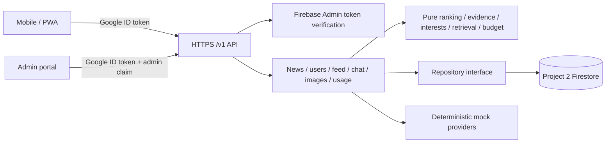

# Project 2 backend handoff

## 1. Overview and current status

This repository implements the backend for a Responsible AI classroom news app. The same JSON API serves a mobile/PWA reader and a web editorial portal. It provides Google/Firebase authentication, editorial authorization, news and provenance, simulated location, personalized feed, events and interest inference, grounded chat, image metadata, and API cost reporting. Gemini and Pexels are optional server-side providers; mocks remain the local default; production Gemini chat is enabled.

**Firebase Project 2:** `proyecto2responsibleai` (project number `580249070554`). The separate Project 1 project is `proyecto1responsibleai` (number `487068590350`). Do not deploy this repository to Project 1. As of 2026-09-26, the Project 2 Web app exists, Cloud Firestore `(default)` is active in `us-central1` with this repository's rules and indexes deployed, Google Sign-In is enabled, and the Functions v2 API is deployed on Blaze. The local tests and emulator also work without cloud billing.

## 2. Architecture



`src/api/app.ts` owns transport and errors. `src/services/` owns workflows. `src/domain/` contains deterministic logic. `src/repository/` has in-memory and Firestore implementations. `src/index.ts` exposes one Functions v2 HTTPS function named `api` in `us-central1`. No persistent chat history is used. A separate Cloud Storage bucket now hosts the user-authorized generated demo illustrations; the API continues to store URL metadata.

## 3. Firebase configuration and setup

- `.firebaserc`: `project1` maps to `proyecto1responsibleai`; `project2` maps to `proyecto2responsibleai`. There is deliberately no default alias.
- Web app ID: `1:580249070554:web:404d6d95ac2eb0b7a92ee3`.
- Fetch the public Web SDK configuration with `npx firebase apps:sdkconfig WEB 1:580249070554:web:404d6d95ac2eb0b7a92ee3 --project proyecto2responsibleai`. The SDK configuration is not committed because this course prohibits committing API keys.
- Google Sign-In is enabled in Project 2. The OAuth brand is `Proyecto2ResponsibleAI`; the support contact is configured in Firebase and is intentionally not stored in this repository. Authorized domains are `proyecto2responsibleai.firebaseapp.com`, `proyecto2responsibleai.web.app`, and `localhost`. Add the frontend production domain before using a custom deployed origin.
- Cloud Firestore `(default)` is Standard/Native in `us-central1`. The checked-in rules and indexes have been deployed to Project 2. `firestore.indexes.json` currently needs no composite indexes because the API queries a single collection or one field at a time.
- Project 2 is on Blaze and the Functions v2 `api` endpoint is deployed at `https://us-central1-proyecto2responsibleai.cloudfunctions.net/api`. The linked billing account is `Mi cuenta de facturación` (ending `522F8E`), which showed a $300 trial credit expiring 2026-10-16 when checked. A seven-day Artifact Registry cleanup policy is active in `us-central1`.
- Images are URL metadata. The demo illustrations are hosted in the isolated Cloud Storage bucket `proyecto2responsibleai-demo-media`; the API has no image upload or generation endpoint.

## 4. Local setup and commands

Prerequisites: Node.js 22+, npm, Java 21+ for Firestore emulator, Firebase CLI login. Run from the repository root:

```bash
npm ci
cp .env.example .env
npm run check
npm run test:rules
npm run test:smoke
npm run build
npx firebase emulators:start --project demo-project2-responsible --only auth,firestore,functions
```

The emulator API base is `http://127.0.0.1:5001/demo-project2-responsible/us-central1/api`. In another terminal, seed the emulator:

```bash
FIREBASE_PROJECT_ID=demo-project2-responsible FIRESTORE_EMULATOR_HOST=127.0.0.1:8080 npm run seed
```

For a production redeployment, run `npm run deploy:project2`. This runs checks and targets `proyecto2responsibleai` explicitly for Functions, Firestore rules, and indexes; Google Sign-In is already enabled in the project. The ignored `.env.proyecto2responsibleai` file currently allows `http://localhost:5173` and the two Project 2 Firebase Hosting origins as browser origins; create it from `.env.example` if using a fresh clone, and add the eventual frontend origin. Production API base: `https://us-central1-proyecto2responsibleai.cloudfunctions.net/api`; append `/v1`. Never run an untargeted `firebase deploy`.

## 5. Environment variables

| Variable                      | Use                                                                                                                  |
| ----------------------------- | -------------------------------------------------------------------------------------------------------------------- |
| `FIREBASE_PROJECT_ID`         | Explicitly `proyecto2responsibleai`; use `demo-project2-responsible` only with emulators. Other IDs are rejected.    |
| `GCLOUD_PROJECT`              | Supplied by Cloud Functions; fallback for runtime project ID.                                                        |
| `CORS_ORIGINS`                | Comma-separated exact browser origins, for example `http://localhost:5173`. Required for browser cross-origin calls. |
| `AI_BUDGET_USD`               | Total allowed estimated API spend; defaults to `20`.                                                                 |
| `AI_PROVIDER`                 | `mock` (default) or `gemini` for grounded chat.                                                                      |
| `GEMINI_API_KEY`              | Server-side only; required when `AI_PROVIDER=gemini`. Uses `gemini-3.5-flash-lite`. Never commit a value.            |
| `IMAGE_PROVIDER`              | `mock-stock` (default) or `pexels` for stock image search.                                                           |
| `PEXELS_API_KEY`              | Server-side only; required when `IMAGE_PROVIDER=pexels`. Never commit a value.                                       |
| `FIRESTORE_EMULATOR_HOST`     | `127.0.0.1:8080` for local Admin SDK scripts; omit protocol.                                                         |
| `FIREBASE_AUTH_EMULATOR_HOST` | `127.0.0.1:9099` for local Auth SDK/Admin SDK integration.                                                           |

Production GEMINI_API_KEY is provided by the Secret Manager binding in src/index.ts, not a plaintext deployment env file. Rotate through firebase functions:secrets:set and redeploy functions:api. Mock emulator runs use an ignored .secret.local placeholder GEMINI_API_KEY=local-unused so they do not request a cloud secret.

`.env.example` is the source template. No service account key is needed in Cloud Functions or the emulator. Live admin/seed scripts need Application Default Credentials with Project 2 permissions.

## 6. Authentication and admin provisioning

1. Frontend initializes the Firebase Web SDK with the Project 2 Web app configuration.
2. Call `signInWithPopup(auth, new GoogleAuthProvider())` (or redirect on mobile/PWA). Obtain `await auth.currentUser.getIdToken()`.
3. Send `Authorization: Bearer <ID_TOKEN>` and `Content-Type: application/json` to all `/v1` endpoints. Refresh the token when Firebase SDK indicates expiry or after an admin claim change.
4. The API verifies the token with Firebase Admin SDK. It derives the UID, name, email and picture from verified claims. It ignores frontend role state and rejects supplied UID fields in event bodies.

An operator provisions an editor **outside the API** after that user has signed in once:

```bash
FIREBASE_PROJECT_ID=proyecto2responsibleai npm run admin:claim -- --uid <AUTH_UID> --grant
```

The script uses Admin SDK Application Default Credentials and sets the Firebase custom claim `admin: true`, preserving other claims. Revoke with `--revoke`. The user must force an ID token refresh (`getIdToken(true)`) or sign out/in. No endpoint grants admin. A missing/invalid token returns 401; a valid non-admin token on `/v1/admin/*` returns 403. The frontend should route by claim only for UX; the backend is authoritative.

## 7. Data models and Firestore rules

See `src/domain/types.ts` for full TypeScript declarations and `src/domain/validation.ts` for accepted writes. API timestamps are ISO 8601 UTC strings. Main models:

```ts
type Scope = "local" | "national" | "international";
type VerificationStatus =
  | "unverified"
  | "single_source"
  | "corroborated"
  | "developing"
  | "conflicting_sources";
type ArticleStatus = "draft" | "published" | "archived";
type EventType =
  | "impression"
  | "article_open"
  | "reading_time"
  | "share"
  | "topic_interaction";

interface SourceRecord {
  name: string;
  url: string;
  publisher: string;
  retrievedAt: string;
  sourceType:
    "news" | "wire" | "official" | "report" | "eyewitness" | "social" | "other";
  stance: "supports" | "disputes" | "context";
  originSource?: string;
  sourceGroup?: string;
  credibilityNote?: string;
}
interface ImageRecord {
  url: string;
  provider: string;
  originalUrl: string | null;
  sourcePageUrl?: string;
  license: string | null;
  attribution: string | null;
  generatedByAI: boolean;
  alteredByAI: boolean;
  retrievedAt: string;
}
interface Article {
  id: string;
  title: string;
  body: string;
  summary: string;
  author: string;
  publisher: string;
  canonicalUrl: string;
  publishedAt: string | null;
  createdAt: string;
  updatedAt: string;
  scope: Scope;
  countries: string[];
  regions: string[];
  topics: string[];
  editorialPriority: "normal" | "high";
  verificationStatus: VerificationStatus;
  sources: SourceRecord[];
  image: ImageRecord | null;
  aiDisclosure: { assisted: boolean; note: string | null };
  status: ArticleStatus;
  humanReview: { reviewedBy: string; reviewedAt: string } | null;
  developing?: boolean;
}
interface UserProfile {
  uid: string;
  displayName: string | null;
  email: string | null;
  photoURL: string | null;
  simulatedLocation: { country: string; region?: string };
  interestWeights: Record<string, number>;
  createdAt: string;
  updatedAt: string;
}
interface UserEvent {
  id: string;
  uid: string;
  type: EventType;
  articleId: string;
  durationSeconds?: number;
  topic?: string;
  timestamp: string;
}
interface AuditRecord {
  id: string;
  articleId: string;
  actorUid: string;
  action: "create" | "edit" | "assess" | "publish" | "archive";
  timestamp: string;
  details?: Record<string, unknown>;
}
interface UsageRecord {
  id?: string;
  provider: string;
  model: string;
  feature: string;
  inputTokens?: number;
  outputTokens?: number;
  estimatedCostUsd: number;
  timestamp: string;
  actorUid?: string;
  correlationId?: string;
}
interface FeedItem {
  article: Article;
  reasons: string[];
}
interface ChatCitation {
  articleId: string;
  title: string;
  sources: Array<{ name: string; url: string; publisher: string }>;
}
interface ChatResponse {
  answer: string;
  citations: ChatCitation[];
  uncertainty: VerificationStatus;
  providerMode: "mock";
}
```

`DraftInput` is the article editorial fields without server-managed IDs, timestamps, status, sources, image, verification, and human review. Required: `title`, `body`, `canonicalUrl`, `scope`, `countries`, `regions`, `topics`, `editorialPriority`. Optional: `summary`, `author`, `publisher`, `developing`, `aiDisclosure`. `SourceInput` is `SourceRecord` with optional `retrievedAt`; `EventInput` is `type`, `articleId`, optional `durationSeconds`/`topic`; `LocationInput` is `{country, region?}`. The API table below gives constraints and examples. Unknown keys are rejected.

| Model / collection                | Main fields                                                                                                                                                                                                                                                   | Access                                                                                                                 |
| --------------------------------- | ------------------------------------------------------------------------------------------------------------------------------------------------------------------------------------------------------------------------------------------------------------- | ---------------------------------------------------------------------------------------------------------------------- |
| `UserProfile` / `users/{uid}`     | `uid`, `displayName`, `email`, `photoURL`, `simulatedLocation`, `interestWeights`, `createdAt`, `updatedAt`                                                                                                                                                   | API writes; client may read own profile.                                                                               |
| `Article` / `news/{id}`           | `title`, `body`, `summary`, `author`, `publisher`, `canonicalUrl`, `publishedAt`, timestamps, `scope`, `countries`, `regions`, `topics`, `editorialPriority`, `verificationStatus`, `sources`, `image`, `aiDisclosure`, `status`, `humanReview`, `developing` | API writes; signed-in clients may directly read published docs only; admin claim may read drafts.                      |
| `SourceRecord` / embedded in news | `name`, `url`, `publisher`, `retrievedAt`, `sourceType`, `stance`, optional `credibilityNote`, `originSource`, `sourceGroup`                                                                                                                                  | Multiple per story. Supporting records linked by publisher, originSource or sourceGroup count as one reporting origin. |
| `ImageRecord` / embedded in news  | `url`, `provider`, `originalUrl`, optional `sourcePageUrl`, `license`, `attribution`, `generatedByAI`, `alteredByAI`, `retrievedAt`                                                                                                                           | `image` may be null.                                                                                                   |
| `UserEvent` / `userEvents/{id}`   | `uid`, `type`, `articleId`, optional `durationSeconds`/`topic`, `timestamp`                                                                                                                                                                                   | API writes; client may read own event doc.                                                                             |
| `AuditRecord` / `audit/{id}`      | `articleId`, `actorUid`, `action`, `timestamp`, optional `details`                                                                                                                                                                                            | Admin read only.                                                                                                       |
| `UsageRecord` / `apiUsage/{id}`   | `provider`, `model`, `feature`, optional token counts, `estimatedCostUsd`, `timestamp`, optional actor/correlation                                                                                                                                            | Admin read only.                                                                                                       |

`scope` is `local | national | international`; `editorialPriority` is a human editorial choice (`normal | high`), not an objective importance claim; article status is `draft | published | archived`. Verification status is `unverified | single_source | corroborated | developing | conflicting_sources`. It is an evidence state, never an AI truth verdict. Firestore client writes are all denied, including for admins; all mutations go through the validated API. Admin SDK bypasses rules, so API role checks are essential. No direct client collection queries are required; use the API for lists.

## 8. API contract

All paths below are relative to the function base. Unless shown otherwise, send a Bearer token. JSON bodies reject unknown keys. Common errors: 400 `INVALID_INPUT`, 401 `UNAUTHENTICATED`, 403 `FORBIDDEN`, 404 `NOT_FOUND`, 409 `PRECONDITION_FAILED`, 429 `BUDGET_EXCEEDED`, 500 `INTERNAL`. Some endpoints omit codes that do not apply.

### Health and reader endpoints

| Method/path           | Role; purpose                        | Request                                                                                                                                         | Success response                                                                                                                                                                           | Typical errors | Example request → response                                                                                                                                                                          |
| --------------------- | ------------------------------------ | ----------------------------------------------------------------------------------------------------------------------------------------------- | ------------------------------------------------------------------------------------------------------------------------------------------------------------------------------------------ | -------------- | --------------------------------------------------------------------------------------------------------------------------------------------------------------------------------------------------- |
| `GET /health`         | Public; liveness                     | No body/query                                                                                                                                   | `{ "status":"ok" }`                                                                                                                                                                        | 500            | `GET /health` → `{ "status":"ok" }`                                                                                                                                                                 |
| `GET /v1/me`          | User; profile/create-on-first-call   | No body/query                                                                                                                                   | `UserProfile`                                                                                                                                                                              | 401, 500       | `GET /v1/me` → `{ "uid":"u1", "simulatedLocation":{"country":"GT"}, "interestWeights":{}, "displayName":"Reader", "email":"r@example.com", "photoURL":null, "createdAt":"...", "updatedAt":"..." }` |
| `PUT /v1/me/location` | User; choose simulated location      | Body `{ "country":"GT", "region":"GT-GU" }`; region optional                                                                                    | Updated `UserProfile`                                                                                                                                                                      | 400, 401, 404  | `PUT /v1/me/location {"country":"US","region":"US-NY"}` → profile with `simulatedLocation` equal to request                                                                                         |
| `GET /v1/locations`   | User; demo choices                   | No body/query                                                                                                                                   | `{ "locations": [{"label":"Guatemala","country":"GT"}, ...] }`                                                                                                                             | 401            | `GET /v1/locations` → list including Guatemala City, New York, Mexico, Spain                                                                                                                        |
| `POST /v1/events`     | User; record behavior                | Body `{ "type":"share", "articleId":"demo-guatemala-river" }`; reading time needs `durationSeconds` (0–3600); topic interaction may use `topic` | 201 `{ "profile": UserProfile }`                                                                                                                                                           | 400, 401, 404  | `POST /v1/events {"type":"reading_time","articleId":"demo-guatemala-river","durationSeconds":45}` → `{ "profile": {"uid":"u1","interestWeights":{"environment":1.5,"community":1.5}, ...} }`        |
| `GET /v1/feed`        | User; personalized published news    | Optional `?limit=1..50`, default 20; no body                                                                                                    | `{ "items": [{"article":Article,"reasons":[string]}], "nextCursor":null }`                                                                                                                 | 400, 401       | `GET /v1/feed?limit=3` → `{ "items":[{"article":{"id":"demo-guatemala-river",...},"reasons":["Relevant to your selected region"]}],"nextCursor":null }`                                             |
| `GET /v1/news/:id`    | User; published article with sources | `:id`; no body/query                                                                                                                            | Full `Article`                                                                                                                                                                             | 401, 404       | `GET /v1/news/demo-guatemala-river` → article with `sources`, `verificationStatus`, `image`                                                                                                         |
| `POST /v1/chat`       | User; grounded chat                  | Body `{ "question":"What happened in the river cleanup?" }`, 3–1000 chars                                                                       | `{ "answer":string, "citations":[{"articleId":string,"title":string,"sources":[{"name":string,"url":string,"publisher":string}]}], "uncertainty":VerificationStatus, "providerMode":"mock" | "gemini" }`    | 400, 401, 429, 502                                                                                                                                                                                  | `POST /v1/chat {"question":"river cleanup"}` → `{ "answer":"Según las noticias disponibles: ...", "citations":[{"articleId":"demo-guatemala-river","title":"[DEMO] ...","sources":[...]}], "uncertainty":"corroborated","providerMode":"mock" }` |

### Admin endpoints

| Method/path                       | Purpose                                  | Request                                                                                                                                                                                                                        | Success response                                                                             | Typical errors                           | Example request → response                                                                                                                                                                                                                                                                             |
| --------------------------------- | ---------------------------------------- | ------------------------------------------------------------------------------------------------------------------------------------------------------------------------------------------------------------------------------ | -------------------------------------------------------------------------------------------- | ---------------------------------------- | ------------------------------------------------------------------------------------------------------------------------------------------------------------------------------------------------------------------------------------------------------------------------------------------------------ |
| `GET /v1/admin/news`              | List all statuses                        | No body/query                                                                                                                                                                                                                  | `{ "items": Article[] }`                                                                     | 401, 403                                 | `GET /v1/admin/news` → `{ "items":[{"id":"demo-guatemala-river","status":"published",...}] }`                                                                                                                                                                                                          |
| `GET /v1/admin/news/:id`          | Inspect draft/provenance                 | `:id`; no body/query                                                                                                                                                                                                           | Full `Article`                                                                               | 401, 403, 404                            | `GET /v1/admin/news/id1` → `{ "id":"id1","sources":[],"status":"draft",... }`                                                                                                                                                                                                                          |
| `POST /v1/admin/news`             | Create draft                             | Body `DraftInput`: `title` (5–250), `body` (10–20000), HTTP(S) `canonicalUrl`, `scope`, nonempty `countries`/`topics`, `regions`, `editorialPriority`; optional `summary`, `author`, `publisher`, `developing`, `aiDisclosure` | 201 full draft `Article`                                                                     | 400, 401, 403                            | `POST /v1/admin/news {"title":"Synthetic city story","body":"Synthetic classroom report","canonicalUrl":"https://example.com/story","scope":"local","countries":["GT"],"regions":["GT-GU"],"topics":["culture"],"editorialPriority":"normal"}` → `{ "id":"<UUID>","status":"draft","sources":[],... }` |
| `PATCH /v1/admin/news/:id`        | Edit draft fields                        | `:id`; partial `DraftInput` body                                                                                                                                                                                               | Updated draft `Article`                                                                      | 400, 401, 403, 404, 409                  | `PATCH /v1/admin/news/id1 {"summary":"Updated summary"}` → draft with new summary                                                                                                                                                                                                                      |
| `POST /v1/admin/news/:id/sources` | Append source                            | `:id`; body `SourceRecord` without `retrievedAt` (server fills), with `name`, HTTP(S) `url`, `publisher`, `sourceType`, `stance`; optional `credibilityNote`, `originSource`, `sourceGroup`                                    | Updated draft `Article`                                                                      | 400, 401, 403, 404, 409                  | `POST /v1/admin/news/id1/sources {"name":"Demo report","url":"https://example.com/report","publisher":"Demo Desk","sourceType":"report","stance":"supports"}` → draft with new `sources[]` entry                                                                                                       |
| `POST /v1/admin/news/:id/assess`  | Compute evidence state                   | `:id`; empty/no body                                                                                                                                                                                                           | Updated draft `Article`                                                                      | 401, 403, 404, 409                       | `POST /v1/admin/news/id1/assess` → `{ "id":"id1","verificationStatus":"single_source",... }`                                                                                                                                                                                                           |
| `PUT /v1/admin/news/:id/image`    | Set or clear image                       | `:id`; body `ImageRecord` or `{ "image": null }` (Firebase-safe removal; raw JSON `null` also accepted by direct Express)                                                                                                      | Updated draft `Article`                                                                      | 400, 401, 403, 404, 409                  | `PUT /v1/admin/news/id1/image {"url":"https://example.com/image.jpg","provider":"editorial","originalUrl":"https://example.com/image.jpg","license":"licensed","attribution":"Demo Desk","generatedByAI":false,"alteredByAI":false,"retrievedAt":"2026-09-26T12:00:00.000Z"}` → draft with `image`     |
| `POST /v1/admin/news/:id/publish` | Human approval and publication           | `:id`; empty/no body                                                                                                                                                                                                           | Published `Article` with `humanReview` and `publishedAt`                                     | 401, 403, 404, 409 (no source/not draft) | `POST /v1/admin/news/id1/publish` → `{ "id":"id1","status":"published","humanReview":{"reviewedBy":"admin-uid","reviewedAt":"..."},... }`                                                                                                                                                              |
| `POST /v1/admin/news/:id/archive` | Remove from reader feed without deletion | `:id`; empty/no body                                                                                                                                                                                                           | Archived `Article`                                                                           | 401, 403, 404, 409                       | `POST /v1/admin/news/id1/archive` → `{ "id":"id1","status":"archived",... }`                                                                                                                                                                                                                           |
| `GET /v1/admin/images/search`     | Find stock candidates                    | Required `?keywords=river%20cleanup` (2–100 chars)                                                                                                                                                                             | `{ "images": ImageRecord[] }`                                                                | 400, 401, 403, 502                       | `GET /v1/admin/images/search?keywords=river` → `{ "images":[{"provider":"mock-stock","generatedByAI":false,"license":"Demo placeholder; replace before production",...}] }`                                                                                                                            |
| `GET /v1/admin/usage`             | Cost dashboard                           | No body/query                                                                                                                                                                                                                  | `{ "totalUsd":number, "remainingUsd":number, "byFeature":object, "byProviderModel":object }` | 401, 403                                 | `GET /v1/admin/usage` → `{ "totalUsd":0,"remainingUsd":20,"byFeature":{"chat":0},"byProviderModel":{"mock/deterministic-v1":0} }`                                                                                                                                                                      |
| `GET /v1/admin/audit`             | Editorial trail                          | Optional `?articleId=<id>`                                                                                                                                                                                                     | `{ "items": AuditRecord[] }`                                                                 | 400, 401, 403                            | `GET /v1/admin/audit?articleId=id1` → `{ "items":[{"articleId":"id1","action":"publish","actorUid":"admin-uid","timestamp":"..."}] }`                                                                                                                                                                  |

## 9. Feed and interest behavior

Call `GET /v1/feed` after login and after each location change. Each item has a full article and `reasons` to display beside prominence. No raw score is exposed. The deterministic score adds region match (5), country match (3), matched topic weight (up to 10, multiplied by 0.45), high `editorialPriority` (3), and freshness `4/(1+ageHours/24)`. Ties sort by article ID. For feeds of at least 3 items, it first reserves local news from the selected region, national news from the selected country, and international news when available; feeds of at least 4 also reserve news marked `editorialPriority: high` by an editor. Remaining slots include a small bonus for unseen topics. Only published news is eligible. A story can satisfy multiple reservations.

Events change interests without an LLM: open `+0.5`, reading at least 30 seconds `+1.5`, share `+2`, topic interaction `+0.75`; impression and shorter reads `+0`. Duplicate tags count once and each topic caps at 10. No interest decay is implemented in this version. The geographic and editorial priority reservations limit filter bubbles. `nextCursor` is currently always null; there is no pagination beyond `limit`.

## 10. Article detail and sources

`GET /v1/news/:id` returns the complete published article. Show `title`, `summary`, `body`, `author`, `publisher`, `publishedAt`, `topics`, location scope, image, verification status, source links, and AI disclosure. A draft or archived ID returns 404 to readers. `canonicalUrl` links to the editorial source page where available; each `sources[]` entry is separate provenance. Source `stance` explains whether a record supports, disputes, or adds context. Editors should fill `originSource` with the original reporting organization (for example Reuters when an outlet republishes Reuters). Use `sourceGroup` for a shared syndication pool or known common ownership. The evidence heuristic merges supporting records connected by normalized publisher, original source, or group before counting corroboration. It cannot discover undisclosed syndication; reviewers must inspect links and provenance before publication.

## 11. Simulated location

Use `GET /v1/locations` for demo options and `PUT /v1/me/location` to save a country code and optional region code. This is a user choice, not GPS; never ask for device location permission. Country uses two uppercase letters (`GT`, `US`, `MX`, `ES`). Region examples are `GT-GU` and `US-NY`. Refetch feed immediately after the successful PUT.

## 12. Events

Send an event after an impression, article open, meaningful reading interval, share action, or topic click. Allowed `type`: `impression`, `article_open`, `reading_time`, `share`, `topic_interaction`. Always include `articleId`; add `durationSeconds` for reading time and `topic` for topic interaction. Use one event per meaningful action; avoid sending a timer tick every second. The article must be published. Never include a UID; the API derives it from the token.

## 13. Chat and citations

Chat is session-temporary: frontend holds messages in memory, and backend stores no transcript. Topic-free Spanish news requests use the deterministic personalized feed order. Specific questions use accent-normalized word matches and Spanish topic aliases, discard weak/incidental geographic matches, and select at most 3 published excerpts. With `AI_PROVIDER=mock`, a deterministic response uses those excerpts. With `AI_PROVIDER=gemini`, the server sends those excerpts to Gemini and records returned input/output tokens and estimated cost. With no relevant article, the server answers locally and sends nothing to Gemini. `citations[]` is built by the server from retrieved article IDs/titles and source name/URL/publisher. Link citations to article detail and the original source. Display `uncertainty` and `providerMode` alongside the answer. The deployed Project 2 environment uses Gemini as of 2026-10-03, with its key in Secret Manager.

## 14. Image workflow and AI labels

Admin may publish with `image: null`. Admin searches keywords through `GET /v1/admin/images/search`, reviews license/attribution, then PUTs a chosen `ImageRecord`. To remove an image through Firebase Functions, send `{ "image": null }`; its outer JSON parser rejects primitive JSON null before the API runs. `mock-stock` returns a placeholder; optional `IMAGE_PROVIDER=pexels` returns up to five real stock candidates with `attribution`, `sourcePageUrl`, and `license`. Show the photographer credit and link to `sourcePageUrl`/Pexels when using a Pexels image. Stock search is illustrative and is **not evidence** that a photo depicts the reported event. Always show an **AI-generated image** label when `generatedByAI` is true and an **AI-altered image** label when `alteredByAI` is true. No image-generation API is implemented. The original seed contains placeholder metadata; an authorized operator import replaced all twelve production demo images with distinct built-in image_gen illustrations, marked generated and illustrative. See the media update in PROJECT2_FRONTEND_HANDOFF.md for storage, variants and the reseeding caveat.

## 15. Admin workflow and evidence

Create draft → edit geography/tags → append independent sources → assess evidence → optionally select image → preview draft → publish as a human editor. `assess` uses publisher, `originSource`, `sourceGroup`, and stance: no sources `unverified`; one independent supporting origin `single_source`; two independent supporting origins `corroborated`; supporting and disputing origins `conflicting_sources`; a developing flag yields `developing` unless sources conflict. Publishing requires a source and writes `humanReview`. An audit record captures create/edit/assess/publish/archive. Publication is never an AI truth claim.

## 16. Error contract

```json
{
  "error": {
    "code": "INVALID_INPUT",
    "message": "Invalid request",
    "details": [{ "path": "country", "message": "Invalid string" }]
  }
}
```

Show form errors from `details` when present. For 401, refresh token/sign in. For 403, show insufficient permissions. For 404, treat a reader article as unavailable. For 409, correct workflow prerequisites. For 429, display budget unavailable. For 502, show provider temporarily unavailable. Never show raw backend stack traces to users.

## 17. Cost tracking

The admin dashboard calls `GET /v1/admin/usage`. Each mock chat writes an `apiUsage` record with zero estimated cost; Gemini chat records returned token counts and an estimate using $0.30 per million input tokens and $2.50 per million output tokens. The service checks a conservative $0.01 reserve against `AI_BUDGET_USD` before each Gemini call, then records measured usage. This is an estimate, not a bill; free-tier charges may differ. Pexels search is not included in the dollar report. Reservations are not atomic, so concurrent paid calls could cross the cap; add a Firestore transaction before broad production use.

## 18. Classroom demo

Use the Firebase Auth, Firestore, and Functions emulators with project `demo-project2-responsible`. Seed 12 explicitly synthetic articles. Sign in with the Auth emulator or create a test user; grant `admin` in the emulator using an operator context for the admin UI. Select Guatemala City, then New York, and compare feeds. Open a corroborated and a conflicting story; show sources/uncertainty. Ask chat about a seeded story and an unrelated topic. In admin, create a draft, add sources, assess, preview, publish, and inspect cost report. The local API URL above is valid only while the emulator runs.

## 19. Seed and safe reset

`npm run seed` upserts deterministic `demo-*` document IDs. Every title begins `[DEMO]`; bodies explicitly state that events are fictional. It covers GT/US/MX/ES, all scopes, multiple topics, high editorial priority, single/corroborated/conflicting/developing evidence, no image, mock stock metadata, and simulated generated-image metadata. Re-run to refresh only these IDs. `npm run seed -- --reset` first deletes only `news` documents with IDs beginning `demo-`, then recreates them. The script refuses any project ID except Project 2 or the named demo emulator. Always set both `FIREBASE_PROJECT_ID` and, for local runs, `FIRESTORE_EMULATOR_HOST` explicitly. Never use this command with Project 1.

## 20. Known pending work and constraints

- Verify a real Google ID token → deployed API → Firestore → feed flow on a phone. The deployed health and unauthenticated routes are verified; the full signed-in production path is not yet verified.
- Configure a real frontend production domain in `CORS_ORIGINS` and Firebase authorized domains.
- Gemini chat is enabled in production with a Secret Manager binding; Pexels stock search remains mock.
- Add an image-generation provider only if the team needs actual AI-generated images; placeholder assets are not for production.
- Add transactional cost reservations and pagination before production scale; the current implementation is sized for a university demo.

## 21. Frontend screen checklist

- [ ] Login: Project 2 Firebase Google sign-in, token refresh, error handling.
- [ ] Feed: `GET /v1/feed`, reasons, scope and editorial priority variety, location refresh.
- [ ] Article: full body, source links, uncertainty, AI disclosure and image labels.
- [ ] Location selector: use demo list and PUT location; no GPS.
- [ ] Chat: temporary messages, mock marker, citations, no-evidence state.
- [ ] Admin login: check refreshed `admin` claim; handle 403 from server.
- [ ] Article editor: draft creation and PATCH with validated fields.
- [ ] Source editor: multiple source records and stances.
- [ ] Validation indicators: render evidence state; show human review before publication.
- [ ] Image selector: nullable image, provenance/license, AI-generated/altered labels.
- [ ] Cost dashboard: aggregate costs and remaining budget.

## 22. Responsible AI presentation requirements

Show why a feed story is prominent using `reasons`. Show every source URL/publisher and chat citation. Use evidence/uncertainty wording rather than “AI verified true.” Distinguish published status from corroboration status. Identify AI-generated or altered imagery in visible text. Retain publisher/canonical URL and mark demo content clearly. Keep human admin approval visible in editorial preview/audit UI.

## 23. What the frontend developer needs

The frontend can start now against the Auth, Firestore, and Functions emulators using the setup in section 4 and the API contract in sections 7–17. Use the Web app ID above and fetch its SDK config with the CLI command in section 3; do not commit the API key because of the course rule. For local Google sign-in against the real Project 2 Auth service, `localhost` is already an authorized domain. The deployed backend allows `http://localhost:5173` and the two Project 2 Firebase Hosting origins. Another frontend origin requires updating Firebase Auth authorized domains and `.env.proyecto2responsibleai`, then redeploying the function.

Production Firestore now contains 12 published, explicitly fictional `demo-*` articles from the seed script. A desktop Chrome test completed Google Sign-In with provider `google.com`, retrieved a Firebase ID token, received HTTP 200 from `GET /v1/me` with the same UID, and received HTTP 200 from `GET /v1/feed` with all 12 demo articles. The frontend developer should repeat that chain in their app and on an actual phone. An operator must grant the test user's admin claim if the editorial portal will be exercised. Gemini production activation was verified on 2026-10-03 through the existing Google reader session and measured apiUsage tokens. Pexels production remains mock. The temporary Hosting test page was removed after testing; the Hosting root currently returns 404 until the frontend is deployed.
